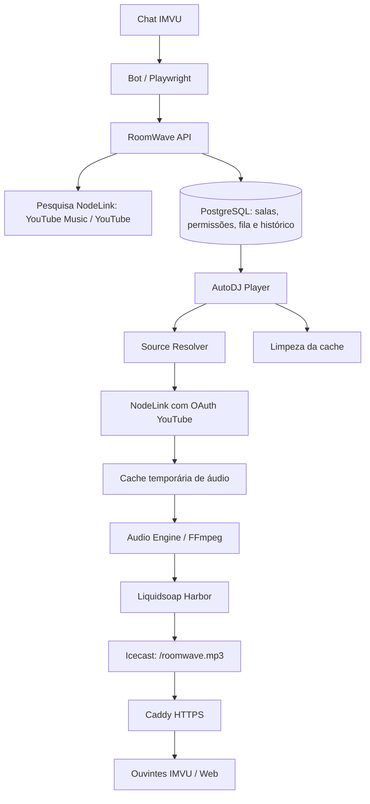

# RoomWaveBOT

Bot para salas IMVU com pedidos musicais, rádio online e comandos de gestão da sala. Desenvolvido em TypeScript e Node.js, com serviços independentes numa instância Ubuntu da AWS EC2.

> Estado: reprodução YouTube com OAuth testada, rádio operacional e comandos personalizados disponíveis. Dashboard Studio disponível com login do dono, controlos e logs. O acesso ao áudio depende da disponibilidade do YouTube e das credenciais configuradas.

## Funcionalidades

- Pedidos por nome ou link YouTube, com pesquisa YouTube Music/YouTube através do NodeLink.
- Fila por sala, histórico e permissões guardados em PostgreSQL.
- AutoDJ com monitorização do estado real do Audio Engine e recuperação após reinícios.
- Resolução da gravação pedida: validação do ID e rejeição de substituições por outra fonte.
- Download temporário, reprodução por FFmpeg e limpeza da cache pelo Player após conclusão, skip ou falha.
- Rádio MP3 através de Liquidsoap, Icecast e HTTPS com Caddy.
- Volume em tempo real pelo chat, sem reiniciar a música.
- Informações da sala: regras, rádio, staff e ajuda.
- Comandos personalizados por sala, geridos exclusivamente pelo OWNER.
- Dashboard web responsivo: fila, reprodução, volume, ligação do bot, comandos e logs filtrados.

## Arquitetura



O NodeLink identifica a faixa e fornece uma fonte de áudio. O Source Resolver descarrega o conteúdo para um ficheiro local; o FFmpeg deteta e descodifica o formato original. Uma extensão `.bin` na cache não significa que o ficheiro seja MP3: pode conter WebM/Opus.

Spotify Control, Browser Player e experiências Lavalink fazem parte do histórico do projeto, mas não são necessários ao percurso atual YouTube → rádio. Redis está disponível na infraestrutura; PostgreSQL mantém a fila persistente.

## Organização

| Pasta | Responsabilidade |
| --- | --- |
| `apps/dashboard` | Studio web com login do dono e integração com as APIs |
| `apps/bot` | Gateway IMVU, comandos e respostas no chat |
| `apps/api` | Salas, membros, pedidos, fila e comandos personalizados |
| `apps/player` | AutoDJ, recuperação e limpeza dos ficheiros temporários |
| `apps/source-resolver` | NodeLink → fonte reproduzível e cache |
| `apps/audio-engine` | Controlo da reprodução e processo FFmpeg |
| `packages/music` | Pesquisa, seleção e metadados das músicas |
| `packages/database` | Prisma, modelos e migrações PostgreSQL |
| `radio` | Configuração Liquidsoap |
| `apps/spotify-control` | Integração experimental Spotify |
| `apps/browser-player` | Player browser anterior, fora do núcleo atual |
| `docs` | Documentação e resultados de verificação |

## Comandos no IMVU

| Comando | Função | Acesso |
| --- | --- | --- |
| `!ping` | Verificar resposta do bot | Todos |
| `!add <música ou link YouTube>` | Pedir música | Todos |
| `!queue` | Consultar fila | Todos |
| `!now` | Consultar música atual/próxima | Todos |
| `!radio` | Mostrar o endereço da rádio | Todos |
| `!regras` | Mostrar regras da sala | Todos |
| `!staff` | Mostrar membros com cargos de staff | Todos |
| `!comandos` / `!help` | Mostrar ajuda | Todos |
| `!volume [0-100]` | Consultar ou ajustar volume global | DJ, MODERATOR, ADMIN, OWNER |
| `!skip` | Saltar música | DJ, MODERATOR, ADMIN, OWNER |
| `!remove <posição>` | Remover da fila | MODERATOR, ADMIN, OWNER |
| `!clear` | Limpar fila | ADMIN, OWNER |
| `!disconnect` | Desligar o gateway IMVU | OWNER |

O volume afeta todos os ouvintes. `0` silencia, `100` mantém o nível original e um reinício do Liquidsoap repõe o valor inicial de `50`. O buffer do ouvinte pode atrasar a perceção das alterações.

### Comandos personalizados — só o dono gere

```text
!criarcomando festa A festa começa às 22h!
!editarcomando festa A festa começa às 23h!
!listarcomandos
!apagarcomando festa
```

Depois de criado, qualquer utilizador pode escrever `!festa`. Apenas OWNER pode criar, editar, apagar e listar os comandos personalizados. São respostas em texto, sem execução de código. Os comandos do sistema estão protegidos contra substituição.

Os nomes têm até 32 caracteres e as respostas até 500. Os dados são guardados por sala e sobrevivem a reinícios. Ver [documentação dos comandos personalizados](docs/custom-commands.md).

## Ambiente e configuração

O projeto utiliza Node.js 24+, pnpm, TypeScript, PostgreSQL, Prisma, Docker, FFmpeg, Liquidsoap, Icecast, Caddy, Playwright e NodeLink. Os serviços da instalação atual são geridos por systemd.

```bash
pnpm install --frozen-lockfile
cp .env.example .env
# Preencher .env com os valores da instalação antes de continuar.
pnpm --filter @roomwave/database db:generate
pnpm --filter @roomwave/database exec prisma migrate deploy --config prisma7.config.ts
```

**Isto não é um instalador completo da infraestrutura.** O repositório contém a aplicação e a configuração Liquidsoap; NodeLink, contas, unidades systemd, Caddy/Icecast e os ficheiros privados precisam de ser configurados separadamente. Algumas rotinas ainda usam caminhos da instalação `/home/ubuntu/roomwave`.

- `docker-compose.yml` disponibiliza PostgreSQL e Redis; não arranca todos os componentes.
- No exemplo, `POSTGRES_HOST=postgres` pressupõe resolução pelo nome do serviço Docker. Para aplicações executadas no host, ajustar a ligação para `127.0.0.1` e a porta publicada.
- Configurar a identidade/sala IMVU, credenciais de login e perfil Playwright na instalação.
- Configurar `NODELINK_URL`, a senha do NodeLink e os endpoints de áudio. OAuth fica no ambiente do contentor; não na página HTML.
- O auxiliar `python3 tools/nodelink-youtube-oauth.py` depende do código NodeLink existente em `nodelink-test`. Guarda o token, mas não o aplica automaticamente ao contentor.
- A API e o bot partilham `.data/custom-commands.key` para autenticar operações de gestão dos comandos. Criar uma chave aleatória com permissões `600` numa instalação nova.
- `radio/secret.liq` define a credencial Icecast e é carregado antes de `radio/roomwave.liq`.
- `ROOMWAVE_PUBLIC_RADIO_URL` define o link apresentado por `!radio`.

Nunca publicar `.env`, cookies, perfis de browser, tokens OAuth, chaves privadas ou cache de áudio. Estes dados ficam fora do Git. Manter interfaces administrativas em rede privada; só a rádio pública deve ser exposta aos ouvintes.

### Serviços e portas da instalação atual

| Componente | Porta/interface |
| --- | --- |
| API | 3001; acesso administrativo a restringir à rede local |
| NodeLink | `127.0.0.1:2334` |
| Audio Engine | `127.0.0.1:3210` |
| Liquidsoap Harbor | `127.0.0.1:3211` |
| Source Resolver | `127.0.0.1:3230` |
| Liquidsoap controlo | `127.0.0.1:1234` |
| Icecast | 8000; mount `/roomwave.mp3` |
| Caddy | HTTPS 443 / redirecionamento HTTP 80 |

## Operação e diagnóstico

Ver serviços:

```bash
sudo systemctl status roomwave-imvu roomwave-api roomwave-player \
  roomwave-source-resolver roomwave-audio-engine roomwave-radio --no-pager
```

Acompanhar pedidos e reprodução:

```bash
sudo journalctl -u roomwave-player -u roomwave-source-resolver \
  -u roomwave-audio-engine -n 100 -f --no-pager
```

Acompanhar chat e comandos:

```bash
sudo journalctl -u roomwave-imvu -u roomwave-api -n 100 -f --no-pager
```

Voltar a ligar o bot depois de `!disconnect`:

```bash
sudo systemctl start roomwave-imvu
```

Reiniciar apenas o bot, sem reiniciar o motor de áudio:

```bash
sudo systemctl restart roomwave-imvu
```

Consultar os serviços locais:

```bash
curl http://127.0.0.1:3210/status
curl http://127.0.0.1:3230/health
```

O estado `PLAYING` confirma reprodução no Audio Engine, mas não garante que o player de cada sala esteja a ouvir. Se a rádio ficar presa no IMVU, verificar também o endereço e a reprodução no cliente.

Reiniciar Liquidsoap durante uma música pode interromper a ligação FFmpeg → Harbor. Não reiniciar toda a infraestrutura para aplicar alterações apenas aos comandos.

## Verificações

```bash
pnpm --filter @roomwave/bot typecheck
pnpm --filter @roomwave/api typecheck
pnpm --filter @roomwave/player typecheck
pnpm --filter @roomwave/music typecheck
node --import tsx --test apps/source-resolver/test/nodelink.test.ts
```

O teste de integração abaixo requer a base de dados local, migrações aplicadas e a chave privada do bot. Cria uma sala temporária e remove os dados de teste no final:

```bash
node --env-file=.env --import tsx apps/api/test/custom-commands.integration.ts
```

## Documentação e próximos passos

- [Verificação NodeLink/OAuth e integração de áudio](docs/nodelink-audio-verification.md)
- [Comandos personalizados e permissões](docs/custom-commands.md)
- [Histórico das experiências YouTube](docs/youtube.md)

O [RoomWave Studio](docs/dashboard.md) está disponível em `/dashboard/`, com login próprio do dono. Para consultar os dados de acesso na EC2: `cat /home/ubuntu/roomwave/.data/dashboard/access.txt`. O dashboard usa as APIs existentes e é independente dos serviços da rádio.
